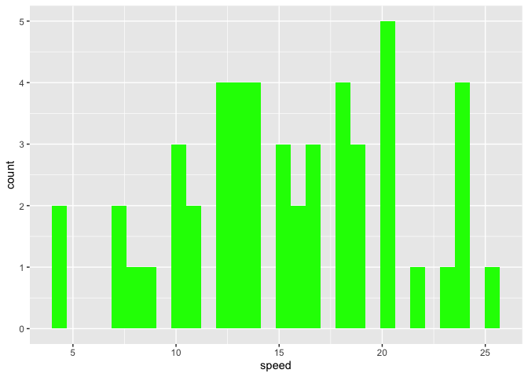

  - [*To the reader*](#to-the-reader)
  - [Part 00. Proposal](#part-00-proposal)
  - [Part 0. Lay out package
    infrastructure](#part-0-lay-out-package-infrastructure)
  - [Part I. Work on functionality 🚧 ✅](#part-i-work-on-functionality--)
      - [Try it out](#try-it-out)
  - [Part II. Packaging and documentation 🚧
    ✅](#part-ii-packaging-and-documentation--)
      - [Phase 1. Minimal working
        package](#phase-1-minimal-working-package)
  - [Traditional README](#traditional-readme)
      - [Bit 7.](#bit-7)

# *To the reader*

Welcome to the R package building helper *readme2pkg.template.lite*\!

Below, is a readme that provides steps for building a package. This
readme acts as a worksheet, checklist, and control document as functions
used in package building are included within and can be used in
advancing development.

We’ll use the `{knitrExtra}` helper package to send code chunks to
different directories in the package.

To install `{knitrExtra}`:

``` 

remotes::install_github("EvaMaeRey/knitrExtra")
```

# Part 00. Proposal

*Note: This README walks through package rational and contains the code
that defines proposed package functions and in addition to first-cut
testing. [TLDR - Jump to traditional readme
content](#traditional-readme)*

Proposing the {xxxx} package\! 🦄
<!-- (typical package introduction write up; but actually aspirational) -->

The goal of {greenhistogram} is to make … easier.

Without the package, we live in the effort-ful world that follows 🏋:

``` r
library(ggplot2)

ggplot(data = cars) + 
  aes(speed) + 
  geom_histogram(fill = "green")  
#> `stat_bin()` using `bins = 30`. Pick better value with `binwidth`.
```

<!-- -->

With the {greenhistogram} package, we’ll live in a different world (🦄 🦄
🦄) where the task is a snap 🫰:

Proposed API:

<!-- The following is fenced off to quote the code, but won't execute.  -->

``` 

library(greenhistogram)

ggplot(data = cars) + 
  aes(speed) + 
  geom_green_histogram()   # new function!
  
```

``` r
# for quick knit (exiting early) change eval to TRUE
# fs::dir_tree(recurse = T)
knitr::knit_exit()
```

# Part 0. Lay out package infrastructure

``` r
devtools::create(".")
```

# Part I. Work on functionality 🚧 ✅

Here is a function that will do some work…

``` r
geom_green_histogram <- function(...){
  
  geom_histogram(fill = "green", ...)
  
}
```

## Try it out

``` r
library(ggplot2)

ggplot(data = cars) + 
  aes(speed) + 
  geom_green_histogram()
#> `stat_bin()` using `bins = 30`. Pick better value with `binwidth`.
```

<!-- -->

# Part II. Packaging and documentation 🚧 ✅

## Phase 1. Minimal working package

To build a minimal working package, 1) we’ll need to document
dependencies 2) send functions to .R files in the R folder, 3) do a
package check (this will A. Document our functions and B. this will help
us identify problems - for example if we’ve failed to declare a
dependency) and 4) install the package locally.

Then we’ll write up a quick advertisement for what our package is able
to do in the ‘traditional readme’ section. This gives us a chance to
test out the package.

``` r
### Bit 2a: in the function(s) you wrote above make sure dependencies to functions using '::' syntax to pkg functions 
usethis::use_package("ggplot2") # Bit 2b: document dependencies, w hypothetical ggplot2
#> ✔ Setting active project to '/Users/evangelinereynolds/Google
#> Drive/r_packages/readme2pkg.template.lite'
#> Error in find_package_root(dir): Could not find R package in `/Users/evangelinereynolds/Google Drive/r_packages/readme2pkg.template.lite` or its parent directories.
```

``` r
# Bit 3: send the code chunk with function to R folder
# knitrExtra::chunk_names_get()
knitrExtra:::chunk_to_r(chunk_name = "geom_green_histogram") 
#> It seems you are currently knitting a Rmd/Qmd file. The parsing of the file will be done in a new R session.
#> Warning in file(con, "w"): cannot open file 'R//geom_green_histogram.R': No
#> such file or directory
#> Error in file(con, "w"): cannot open the connection
```

``` r
# Bit 4: document functions and check that package is minimally viable
devtools::check(pkg = ".")  

# Bit 5: install package locally
devtools::install(pkg = ".", upgrade = "never") 
```

# Traditional README

### Bit 7.

Write traditional README that uses built package (also serves as a test
of build). 🚧 ✅

The goal of the {xxxx} package is to …

Install package with:

    remotes::install_github("GithubCoolUser/mypacakge")

Once functions are exported you can remove go to two colons, and when
things are are really finalized, then go without colons (and rearrange
your readme…)

``` r
rm(list = ls())
library(greenhistogram)  ##<< change to your package name here

# some demonstration code here, accessing function w ::: syntax
```

``` r
# for quick knit (exiting early) change eval to TRUE
# fs::dir_tree(recurse = T)
knitr::knit_exit()
```
